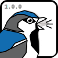

<h1 align="center">

    

</h1> 

Sound Propagation with Acoustic Radiosity for Realistic Outdoor Worlds.

# Getting Started

Follow our [example notebooks](https://sparrowpy.readthedocs.io/en/stable/examples.html) to get a sense of the structure and functions of sparrowpy.

## Installation

Use pip to install sparrowpy

    pip install sparrowpy

(Requires Python >= 3.10)

if numba is installed the code will be precompiled and will run faster. We strongly recommend to use numba to accelerate the simulations significantly

    pip install sparrowpy numba

Geometry import via blender or STL files will be supported in a future release, an install of the Blender API. Note that blender has strong requirements on the python version, see [pypi](https://pypi.org/project/bpy/). You can install it via pip

    pip install bpy

by default these packages are not installed

## Contributing

Check out the [contributing guidelines](https://sparrowpy.readthedocs.io/en/stable/contributing.html) if you want to become part of sparrowpy.
